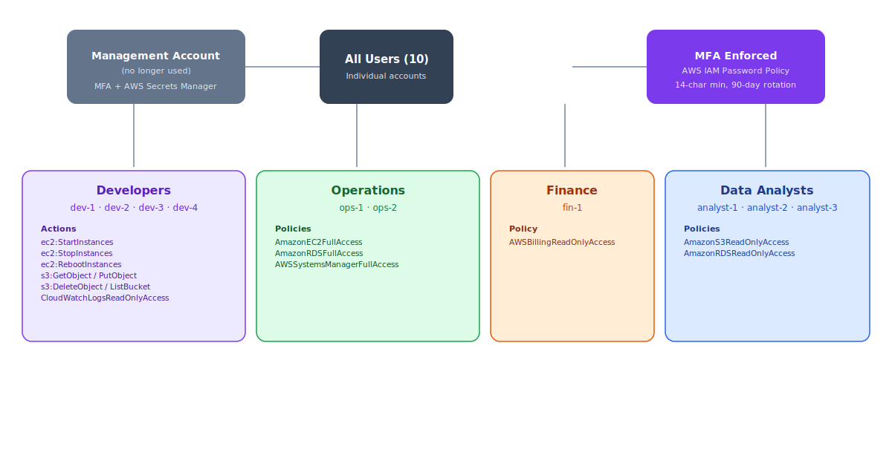

# Nexacore IAM Security Project

> **Retiring a shared AWS root account in favor of least-privilege, MFA-enforced, fully audited access — built entirely with Terraform**

[](https://www.terraform.io/)
[](https://aws.amazon.com/iam/)
[](https://aws.amazon.com/cloudtrail/)

## 📋 Project Overview

NexaCore Solutions (a hypothetical company) had ~10 employees sharing a single AWS root account, with credentials passed around over Teams and Slack — no accountability, no visibility, and full access exposure if anything leaked. This project replaced that setup with individual IAM users, role-based access control across four teams, account-wide MFA enforcement, and CloudTrail auditing so every action is traceable.

**🚨 📖 [View Full Documentation](DOCUMENTATION.md)** for the full step-by-step implementation walkthrough. 🚨

🚨 The full narrative write-up is also on Medium: [Implementation Guide: NexaCore Solutions IAM Security Project](https://medium.com/@a.arale86/implementation-guide-nexacore-solutions-iam-security-project-64842b02ce50) 🚨

## 🏗️ Architecture



**Model:** Shared root account (retired) → individual IAM users, all MFA-enforced under an account-wide password policy → grouped into Developers, Operations, Finance, and Data Analysts, each scoped to a least-privilege policy for their role → all activity captured account-wide by CloudTrail.

## 🚀 Key Features

- **Individual IAM Users** - `for_each`-driven user creation, replacing a single shared root login
- **Role-Based Access Control** - four groups (Developers, Operations, Finance, Analysts), each scoped to what that role actually needs
- **Least-Privilege Policies** - custom JSON policies via `jsonencode()`, including region and resource-tag conditions
- **Account-Wide MFA Enforcement** - a dedicated policy attached to every group
- **Strict Password Policy** - 14-character minimum, full complexity, 90-day rotation
- **Multi-Region CloudTrail** - account-wide audit trail with log file validation, writing to a locked-down S3 bucket
- **Security Alerting** - SNS topic wired up for security-relevant activity

## 🛠️ Technologies

| Category | Technologies |
|----------|-------------|
| **IAM** | IAM Users, Groups, Policies, MFA, Account Password Policy |
| **Auditing** | AWS CloudTrail, S3 (log storage), SNS (alerting) |
| **IaC** | Terraform, `jsonencode()`, `for_each` |
| **Identity** | `aws_caller_identity` for account-scoped resource naming |

## 💡 What I Learned

✅ IAM group/user/policy design in Terraform
✅ Writing least-privilege JSON policies with `jsonencode()`
✅ Scaling repetitive resources with `for_each` instead of copy-pasting blocks
✅ Configuring CloudTrail for account-wide audit logging, including the S3 bucket policy CloudTrail needs to actually write logs
✅ Testing IAM policies against real AWS resources and the AWS Policy Simulator

## 📁 Project Structure

```
Nexacore-IAM-Security-Project/
├── main.tf                     # CloudTrail, S3 buckets, bucket policy, SNS alerting
├── iam-groups.tf                # IAM groups + policy/MFA attachments
├── iam-user.tf                  # IAM users (for_each) + group membership
├── iam-policy.tf                 # Custom least-privilege policies (dev/ops/analyst/MFA)
├── password-policy.tf            # Account-wide password policy
├── variables.tf                  # Input variables (region, alert email, db password)
├── outputs.tf                     # Account ID, bucket name, per-team user outputs
└── terraform.tvars.example        # Template for terraform.tfvars
```

## 🔧 Key Implementation Highlights

### Access Design
- **Developers (4 users)** - EC2/S3 scoped to development resources, read-only CloudWatch logs, no production access
- **Operations (2 users)** - broad infrastructure management, explicitly denied IAM write permissions to prevent privilege escalation
- **Finance (1 user)** - AWS managed `Billing` + `ReadOnlyAccess` policies, no custom policy needed
- **Analysts (3 users)** - read-only access to one analytics bucket and RDS metadata, nothing else

### CloudTrail Auditing
- Multi-region trail with log file validation enabled
- Dedicated, public-access-blocked S3 bucket named with the account ID for uniqueness
- Explicit bucket policy granting CloudTrail's service principal exactly the permissions it needs — nothing broader
- `depends_on` ensures the bucket policy exists before the trail, so log delivery works from the first run

### Challenges Overcome
- ✅ Caught the common pitfall where CloudTrail creates successfully but silently delivers zero logs without an explicit bucket policy
- ✅ Replaced per-user resource blocks with `for_each` to avoid typos and inconsistencies as teams grow
- ✅ Verified every group's access matrix (allowed **and** denied actions) against real AWS resources, confirming denials surfaced as `AccessDenied` rather than failing silently

## 📚 Documentation

For the complete walkthrough including:
- The planning/access-design process per team
- Full Terraform code for every resource
- CloudTrail + S3 bucket policy setup
- The testing matrix and results after implementation

**➡️ [Read the Full Documentation](DOCUMENTATION.md)**

## 🤝 Connect With Me

<div align="center">

[](mailto:abdijarale@gmail.com)
[](https://github.com/abdiarale86)

</div>

---

<div align="center">

**⭐ If you found this project helpful, please consider giving it a star!**

</div>
